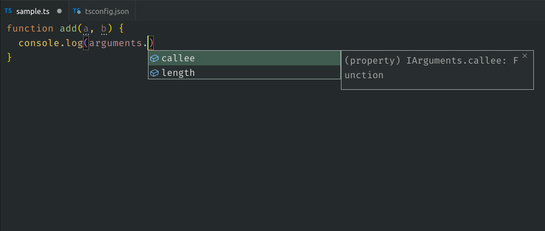
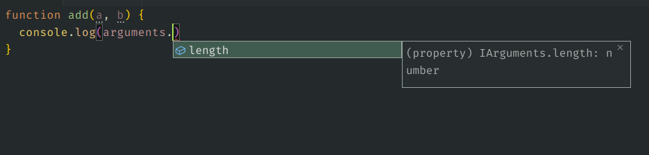

# Ts Plugin Sample

## Quickstart 🚀

```sh
git clone https://github.com/SimonSiefke/ts-plugin-sample &&
cd ts-plugin-sample &&
npm ci &&
npx tsc -b
```

## Usage

Run `npx tsc -b` to generate `plugin.js`. Then reload vscode and open `sample.ts`.

Before:



After:


## Credits

The sample is based on the ts plugin sample inside the [typescript wiki](https://github.com/microsoft/TypeScript/wiki/Writing-a-Language-Service-Plugin).
